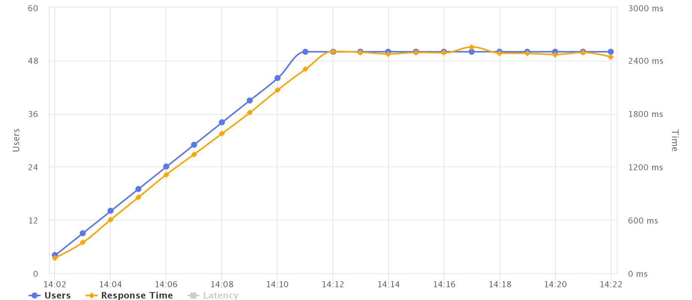

# Load Test Report: Sejours API

## Content
1. [ Peak Load Test ](#50users)
1. [ Blazemeter Test ](#50users)
1. [ LoadUI Pro Test ](#summary)


<a name="50users"></a>

## 1. Peak Load Test 

To test the server under a heavier than expected load. See how the server perfoms under a suddenly increased load.


<a name="summary"></a>

## 2. Blazemeter Test

### 2.1 Overview Charts

- 1 Sejour:


- All Sejours:


- **Maximum Users** - The Maximum number of Virtual Users that were tested. Important for the api load capabilities.

- **Average Throughput** - The average number of Hits per Second per user during the test. Important for understanding the amount of traffic your site or app can handle. It's the number of requests a the api can process in a unit time.

- **Errors** -  The error percentage out of all requests.

- **Average Response Time** - How long, in milliseconds, did it take the average user to receive a response for their request. Important for measuring and understanding your users’ experience when using the API.

- **90% Response Time** - The slowest response time, in milliseconds, the 90th percentile receives. This is important for measuring and understanding the majority of your users’ experience, when using your site or app, excluding extreme incidents.

- **Average Bandwidth** - The average amount of data transferred. This helps to understand the typical network load on your servers during high traffic scenarios.


### 2.2 Top 5 Slowest Responses (Avg. Response Time)
| Request | # Samples           | Avg Time  | 90% Time | Max Time |
|:-------:|:--:|:-:|:-:|:-:|
|    1 Sejour   |   261000 | 171.29 ms  |  263 ms |  3983 ms |
|     All Sejours    |  23603  | 1909.15 ms |3119 ms   |  10687 ms |


### 2.3 Top 5 Errors
| Request | Error Code | Error Message         | % of executions  | Count| 
|:-------:|:-------:|:--:|:-:|:-:|:-:|
|1 Sejour|    429   |   Too Many Requests | 11.46% |  29900|  
|All Sejour|    429   |   Too Many Requests | 0.03% |  6| 

This is because of free plan Zeit server. 
> We limit the number of calls you can make over a certain period of time. Rate limits vary and are specified by the following header in all responses:

```json
When the rate limit is exceeded, an error is returned with the status "429 Too Many Requests":

{
  "error": {
    "code": "too_many_requests",
    "message": "Rate limit exceeded",
  }
}
```


### 2.4 Timeline Graphs
- Concurrent Users and Hits/s:


- **Hits per Second** - The Number of VU corresponds with the number of Hits per Second. This means that the system is able to manage the rise in the Number of VU, without harming their abilities to send requests. So a system that is working smoothly.

- Concurrent Users and Response Time:



- **Virtual Users** - The Number of Virtual Users goes up, but the Average Response Time is some what affected and changing. This system has no bottlenecks for these variables, and user experience is consistent.

- **Response Time** - The time that passed to perform the request and receive full response.

- **Latency** -  Difference in time at which the response is received and the time at which the request has started

## 3. LoadUI Pro Test
